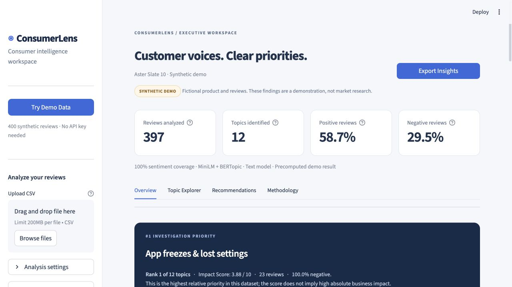
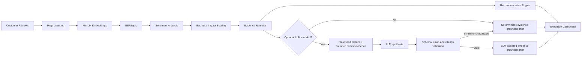

# ConsumerLens

**AI-powered consumer intelligence from customer reviews.**

ConsumerLens turns unstructured review text into measurable consumer topics, transparent investigation priorities, and recommendations linked to the exact supporting evidence.

> **Synthetic demo:** The included Aster Slate 10 product and all bundled reviews are fictional. Demo results illustrate the workflow and are not market research or model-performance claims.



## The problem

Product teams can receive thousands of reviews but still struggle to answer three practical questions: what customers discuss, which issues deserve investigation first, and what evidence supports the next action. Generic sentiment dashboards lose topic context; unrestricted LLM summaries can invent statistics or conclusions.

ConsumerLens combines semantic NLP with auditable quantitative analytics. Every priority can be traced from a topic, through calculated metrics, to review evidence and a proposed action.

## Product capabilities

- Upload a review CSV or open the one-click synthetic demo.
- Validate schema, remove empty/noise-only reviews and exact normalized duplicates, and report data quality.
- Discover consumer topics with MiniLM embeddings and BERTopic, with embedding KMeans and offline TF-IDF fallbacks.
- Classify review-level sentiment with a Hugging Face model or a transparent rating proxy.
- Rank topics with a visible 0–10 Business Impact Score and relative investigation rank.
- Detect emerging, stable, and declining topic share using percentage-point change.
- Inspect keywords, score components, sentiment mix, and representative review evidence.
- Generate deterministic evidence-grounded recommendations without an API key.
- Optionally generate an LLM-assisted evidence-grounded brief from structured analytical outputs only.
- Export topic metrics, annotated reviews, and cited recommendations as CSV.

## Architecture and workflow



The primary pipeline remains:

```text
CSV or demo reviews
→ preprocessing
→ MiniLM embeddings
→ BERTopic topic discovery
→ sentiment analysis
→ Business Impact Score
→ representative evidence
→ recommendations
```

## Methodology

### Data preparation

Only `review_text` is required. Preprocessing uses conservative Unicode and whitespace normalization, removes blank/noise-only rows and exact normalized duplicates, parses dates and 1–5 ratings, and preserves punctuation and stopwords for semantic modeling.

### Topic discovery

The preferred path embeds reviews with `all-MiniLM-L6-v2` and clusters them with BERTopic. BERTopic outliers remain visible as `Unassigned / mixed`. If BERTopic cannot produce usable clusters, ConsumerLens falls back to embedding KMeans. An explicit offline mode uses TF-IDF plus KMeans. KMeans uses `random_state=42`.

V2 keeps the original `review_text` unchanged and creates a separate `topic_text` modeling field. Qualitative error analysis found that repeated synthetic context sentences—such as days-of-use, commute, gift, and generic usage phrases—were dominating some clusters. V2 removes only the generator's known template phrases from `topic_text` before embedding. The 50 human topic labels remained held out: they were loaded only after clustering and cluster naming, and were not used to train, tune, or directly assign topics.

Topic names default to deterministic keyword labels. The synthetic demo includes shorter presentation labels reviewed against representative evidence; original model labels remain visible in Topic Explorer and assignments do not change.

### Sentiment and trends

The preferred text model is `cardiffnlp/twitter-roberta-base-sentiment-latest`. Its signed score is `P(positive) − P(negative)`. If unavailable, valid ratings map to positive (4–5), neutral (3), or negative (1–2); missing ratings remain `Unknown`.

Trend analysis splits dated reviews at the midpoint of the observed date range and compares topic share using each period’s dated-review denominator. A change of at least ±2 percentage points is labeled emerging or declining. This is descriptive and not a significance test.

## Business Impact Score

```text
Impact Score =
  0.35 × Prevalence
+ 0.30 × Negative Intensity
+ 0.20 × Purchase Relevance
+ 0.15 × Trend Growth
```

Each component is normalized to 0–10:

| Component | Calculation | Meaning |
|---|---|---|
| Prevalence | `10 × topic reviews / valid reviews` | How much of this dataset discusses the topic |
| Negative intensity | Mean negative polarity magnitude across known sentiment, scaled to 10 | Frequency and strength of negative sentiment |
| Purchase relevance | Share matching explainable commercial terms, scaled to 10 | Presence of price, value, purchase, return, quality, or recommendation language |
| Trend growth | Positive later-minus-earlier share change, capped at 10 | Increasing share of dated reviews; declines score zero |

Unavailable components are omitted and the remaining weights are rescaled. The UI shows component values, available weight, and sentiment coverage.

The score is an **investigation-priority index**, not expected revenue, ROI, severity, or causal impact. ConsumerLens therefore shows both values:

```text
#1 Investigation Priority
Rank 1 of 12 topics
Impact Score: 3.88 / 10
```

Rank is relative to the analyzed dataset; a first-place topic can still have a modest absolute score.

## Evidence-grounded recommendation design

The default mode is labeled **Deterministic evidence-grounded brief** and requires no API key. It produces Product, Pricing, and Marketing investigation proposals from calculated metrics and cited reviews.

When explicitly enabled, the optional LLM receives only:

- topic name and relative rank;
- prevalence, sentiment, trend, and purchase-relevance metrics;
- Business Impact Score and its components; and
- a bounded set of review IDs, text, source labels, and sentiment labels.

It does not receive the original dataframe or hidden business context. The response must contain exactly one Product, Pricing, and Marketing action. Python validates the response schema, topic IDs, same-topic citations, text lengths, and rejects numerical, causal, revenue, guaranteed, or market-wide claims in generated prose. Calculated evidence is added by Python. Invalid responses automatically fall back to the deterministic brief.

Every displayed recommendation follows this chain:

```text
Topic
→ quantitative metrics and rank
→ representative review evidence
→ business implication
→ recommended action
```

Supporting reviews remain expandable in the dashboard. LLM mode is labeled **LLM-assisted evidence-grounded brief**. Both modes propose hypotheses for validation rather than proven remedies.

## Evaluation

Run the reproducible evaluation against the saved semantic demo result:

```bash
python evaluation/evaluate_system.py
```

This writes [evaluation/system_evaluation.json](evaluation/system_evaluation.json) and [evaluation/system_evaluation.csv](evaluation/system_evaluation.csv). Current synthetic-demo results are:

| Measurement | Result | What it establishes |
|---|---:|---|
| Review-weighted lexical topic cohesion proxy | 0.6227 cosine similarity | Descriptive TF-IDF document-to-centroid similarity; not topic accuracy |
| Sentiment coverage | 100.0% | Every valid demo review received a sentiment label; not sentiment correctness |
| Topic assignment coverage | 91.94% | Share assigned to a non-outlier BERTopic cluster |
| BERTopic outlier rate | 8.06% (32 reviews) | Share retained as `Unassigned / mixed` |
| Deterministic recommendation citation rate | 100.0% | Every recommendation had existing, same-topic review citations |
| Deterministic reproducibility | Identical across two runs | Canonical deterministic brief output matched for the same saved input |
| Maximum impact-score recalculation difference | `5.10e-11` | Saved and recalculated scores matched within floating-point precision |
| Human-validated baseline topic accuracy | 52.0% (26/50) | Agreement on the fixed manually labeled sample |
| Human-validated sentiment accuracy | 98.0% (49/50) | Sentiment agreement on the same sample |
| Completed human validation rows | 50 of 50 | All held-out evaluation rows have human topic and sentiment labels |

The lexical cohesion proxy is not semantic coherence or human topic quality. Citation validity does not establish recommendation usefulness. LLM recommendation quality is not human-benchmarked.

`evaluation/sample_validation.csv` is the preserved baseline validation set. Its labels and baseline correctness columns are never rewritten by the V2 experiment.

### V2 topic-modeling experiment

Run the template-aware experiment separately from the baseline:

```bash
PYTHONHASHSEED=42 HF_HUB_OFFLINE=1 TRANSFORMERS_OFFLINE=1 python evaluation/evaluate_topic_model_v2.py
```

The saved V2 run improved topic accuracy from **52.0% to 78.0%**, a **+26.0 percentage-point** change. Its outlier rate was **9.57%**, compared with **8.06%** at baseline, so assignment coverage moved from **91.94% to 90.43%**. Across all 397 valid reviews, 175 normalized business-topic assignments changed. On the 50-review validation set, 16 baseline errors were corrected and 3 previously correct assignments became incorrect. Sentiment stayed fixed at 98.0% accuracy and 100% coverage.

Outputs are isolated in `data/demo_analysis_v2.json` and `evaluation/topic_v2_*`; baseline snapshots, evaluation results, and human labels remain unchanged. See [evaluation/topic_v2_comparison.json](evaluation/topic_v2_comparison.json) for examples and [evaluation/topic_v2_confusion.csv](evaluation/topic_v2_confusion.csv) for the per-topic error breakdown. The sample is small and BERTopic can vary across environments, so the change is descriptive rather than a general performance claim.

## Tech stack

- Python 3.11
- Streamlit and Plotly
- pandas, NumPy, and scikit-learn
- Sentence Transformers (`all-MiniLM-L6-v2`)
- BERTopic, UMAP, and HDBSCAN
- Hugging Face Transformers sentiment pipeline
- Optional OpenAI-compatible Chat Completions API

## Local setup

Python 3.11 is recommended and was used for the V2 clean-install validation.

```bash
git clone <your-repository-url>
cd consumerlens
python3.11 -m venv .venv
source .venv/bin/activate
python -m pip install --upgrade pip
python -m pip install -r requirements.txt
streamlit run app.py
```

The first live semantic run downloads public model weights. The bundled one-click demo uses a saved result from the same semantic pipeline and requires no model download or API key. Select offline topic discovery and disable text sentiment for a download-free uploaded-file workflow.

### Optional LLM configuration

```bash
cp .env.example .env
# Add OPENAI_API_KEY to .env. Never commit .env.
```

Optional variables are `OPENAI_BASE_URL` and `OPENAI_MODEL`. Review text included in the bounded evidence pool is sent to the configured provider only after the user enables LLM mode and generates a new brief. Confirm that your data may be shared with that provider.

## CSV schema

`review_text` is required. Supported aliases are `review`, `text`, `comment`, and `content`.

| Column | Required | Accepted aliases | Notes |
|---|---|---|---|
| `review_text` | Yes | `review`, `text`, `comment`, `content` | Consumer review text |
| `rating` | No | `stars`, `score`, `review_score` | Expected range: 1–5 |
| `date` | No | `review_date`, `created_at`, `timestamp` | ISO dates recommended |
| `product` | No | — | Product label |
| `source` | No | — | Review source label |

Example:

```csv
review_text,rating,date,product,source
"Battery lasts through my commute",5,2026-01-12,Aster Slate 10,Synthetic Survey
"The latest update causes restarts",2,2026-05-03,Aster Slate 10,Synthetic Forum
```

## Repository structure

```text
consumerlens/
├── app.py
├── requirements.txt
├── data/
├── assets/
├── prompts/
├── src/
│   ├── preprocessing.py
│   ├── topic_modeling.py
│   ├── sentiment.py
│   ├── trend_analysis.py
│   ├── impact_scoring.py
│   ├── insight_agent.py
│   └── exporting.py
├── evaluation/
└── tests/
```

## Limitations

- The included demo is synthetic, templated, English-language data and cannot establish real-world model performance.
- Topic assignments can change with corpus composition and library/platform versions. Reviews receive one primary topic, so mixed aspects may be lost.
- Sentiment is review-level rather than aspect-level and can miss sarcasm, domain language, and mixed opinions. Rating fallback is only a proxy.
- The Business Impact Score uses transparent heuristic weights that require stakeholder calibration; it is not financial impact.
- Trend labels use a two-period descriptive threshold without statistical significance testing.
- Purchase relevance is a keyword heuristic and does not model context or negation.
- LLM outputs remain interpretation. Schema and citation validation reduce unsupported claims but do not replace analyst review.
- Review sampling, source mix, duplicate policy, and missing dates or ratings can bias results.
- Portfolio-scale local processing may be slow for large datasets on CPU.
